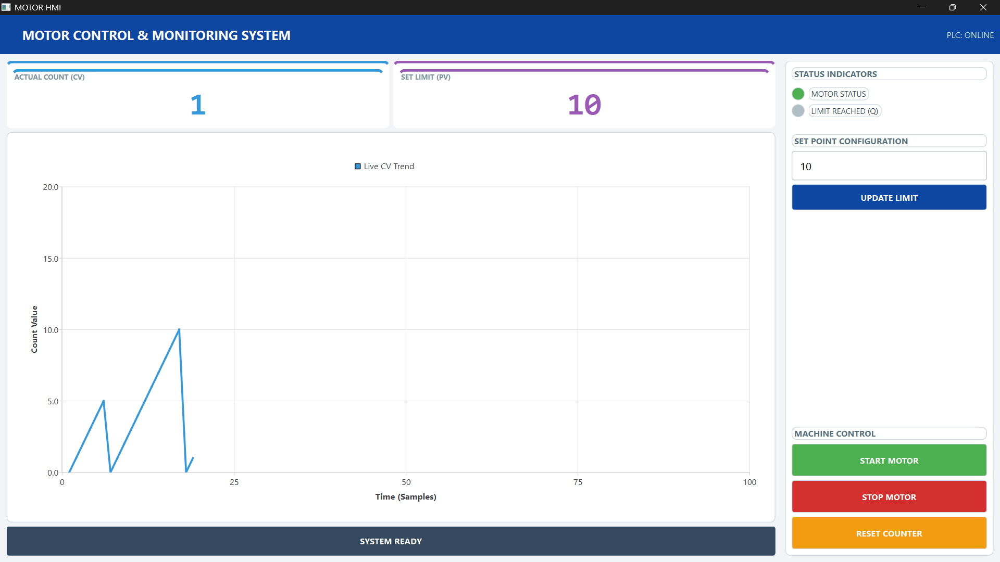
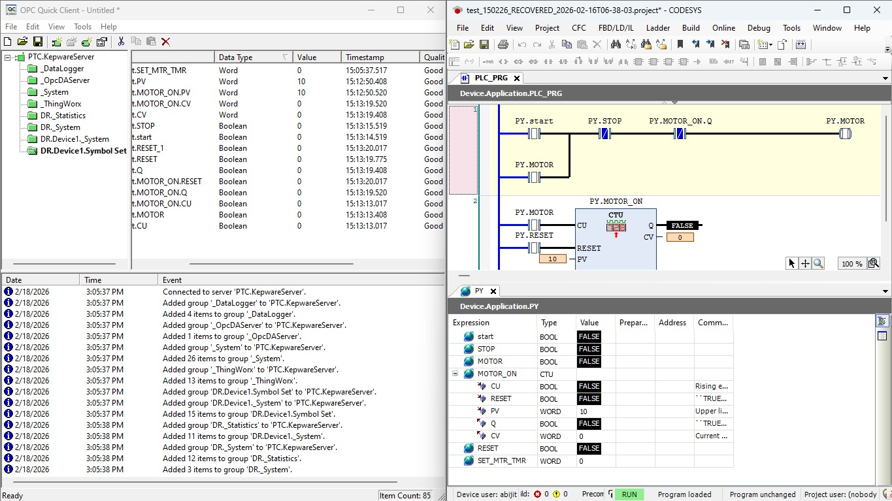

# 🌐 Networked Industrial SCADA System (Python + OPC UA)


## 📌 Project Overview
This project demonstrates a real-world industrial **Client–Server SCADA architecture** where a Python-based HMI communicates with a remote PLC through Kepware OPC UA over LAN.

The system is built across two separate physical machines to replicate an actual factory environment where the control room and machine network operate independently.

This is not a simulation-only UI — it performs real-time read/write communication with PLC logic through industrial protocols.

---

## 🏗 System Architecture

| Machine | IP Address | Role | Software |
|--------|-----------|------|---------|
| **PC 1 (Server)** | `192.168.0.20` | PLC + OPC UA Server | CODESYS SoftPLC + Kepware |
| **PC 2 (Client)** | `192.168.0.10` | SCADA/HMI | Python (PySide6) |

### Data Flow
`Python HMI` → `OPC UA (TCP/IP)` → `Kepware` → `PLC`
`PLC` → `Kepware` → `Python HMI (Feedback)`

Operator commands and setpoints are written to the PLC via OPC UA, and live machine data is read back into the HMI for monitoring and visualization.

---

## 🖥 Screenshots

### 1. HMI Dashboard (Running on Client PC)


### 2. Kepware & PLC Status (Running on Server PC)


---

## 🚀 Features

### Real-time Control
- Start / Stop / Reset motor from remote HMI
- Setpoint writing to PLC (PV update)
- Bi-directional OPC UA communication

### Live Monitoring
- Process value & count monitoring
- Motor status & limit indicators
- PLC online/offline detection

### Visualization
- Real-time trend chart (CV tracking)
- Dynamic alarm/status messages
- Industrial UI design (PySide6)

### Network Architecture
- Two-PC industrial setup
- OPC UA over LAN
- Firewall & port configuration (Port 49320)
- Remote PLC control from separate machine

---

## ⚙️ Requirements

### Server PC
- CODESYS SoftPLC running
- Kepware OPC UA configured
- OPC UA port open (default: 49320)

### Client PC
Install dependencies:
```bash
pip install PySide6 opcua qt-material
